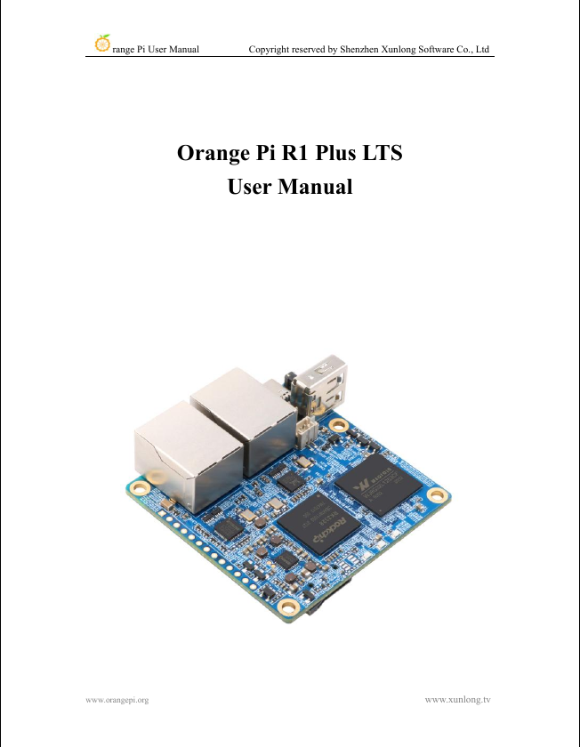
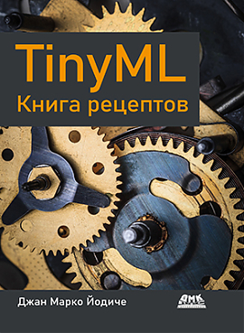
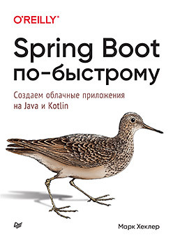
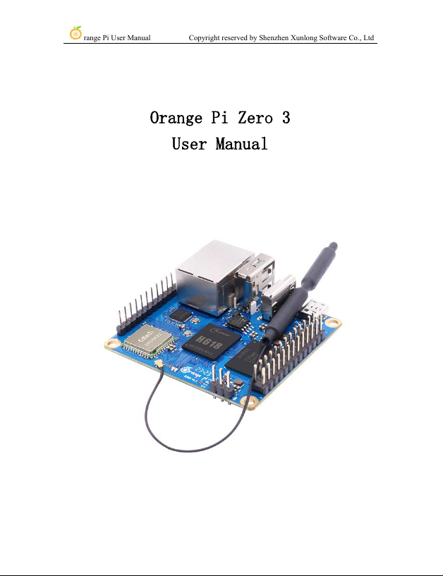
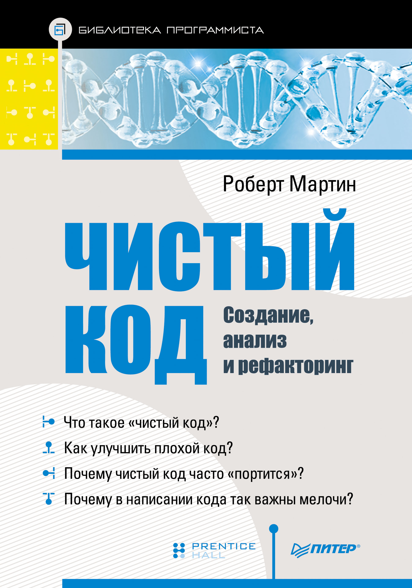

# read books

## Бирюков А. А. - Информационная безопасность: защита и нападение (3-е изд.)
2024, 442 pages, reading period: 03.01.25 - 02.03.25\

 

## Kevin Mitnick - The Art of Invisibility (Russian version: Искусство быть невидимым)
2019, 464 pages, reading period: 14.01.25 - 14.02.25\

 

## Жуков А. Н. - Хакерство. Физические атаки с использованием хакерских устройств
2023, 306 pages, reading period: 28.11.24 - 03.01.25\

 

## Orange Pi R1 Plus LTS User Manual
2020, 170 pages, reading period: 30.10.24 - 12.11.24\

 

## Gian Marco Iodice - TinyML Cookbook (Russian version: TinyML Книга рецептов)
2024, 298 pages, reading period: 22.02.24 - 29.10.24\

 

## Mark Heckler - Spring Boot: Up and Running (Russian version: Spring Boot по-быстрому)
2022, 352 pages, reading period: 13.03.24 - 31.08.24\

 

## Orange Pi Zero 3 User Manual
2023, 321 pages, reading period: 29.06.24 - 01.08.24\

 

## Robert C. Martin - Clean Code (Russian version: Чистый Код)
2012, 464 pages, reading period: 13.01.24 - 22.02.24\

 

## Nik Lumi - EXCEPTIONS IN JAVA (Basics, advanced concepts, and real API examples)
2022, 115 pages, reading period: 09.01.24 - 07.02.24\

 

## Ken Kousen - Mockito Made Clear Java Unit Testing with Mocks, Stubs, and Spies
2023, 87 pages, reading period: 06.01.24 - 09.01.24\

 

## Robert C. Martin - Clean Craftsmanship (Russian version: Идеальная Работа)
2024, 384 pages, reading period: 31.12.23 - 06.01.24\

