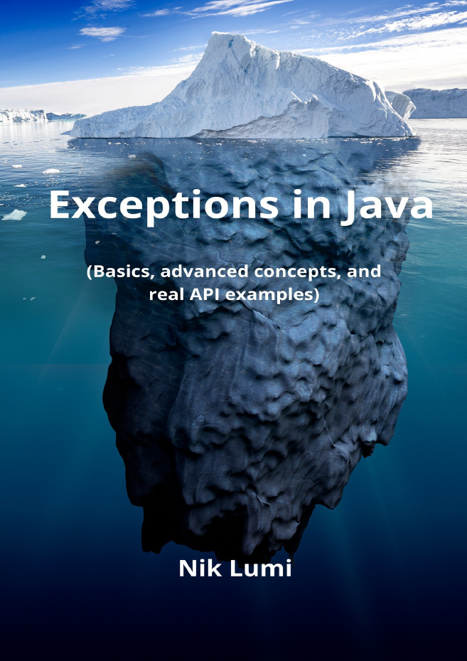
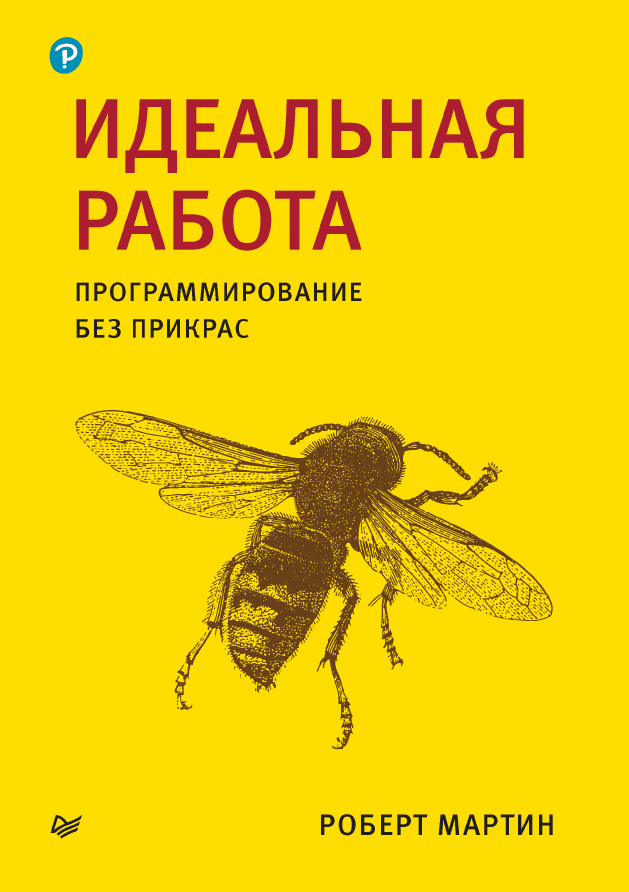

# read books

## Nik Lumi - EXCEPTIONS IN JAVA (Basics, advanced concepts, and real API examples)
2022, 115 pages, read period: 09.01.24 - 07.02.24\

## Ken Kousen - Mockito Made Clear Java Unit Testing with Mocks, Stubs, and Spies
2023, 87 pages, read period: 06.01.24 - 09.01.24\
<!-- \ -->

## Robert C. Martin - Clean Craftsmanship (Russian verion: Идеальная Работа)
2024, 384 pages, read period: 31.12.23 - 06.01.24\

