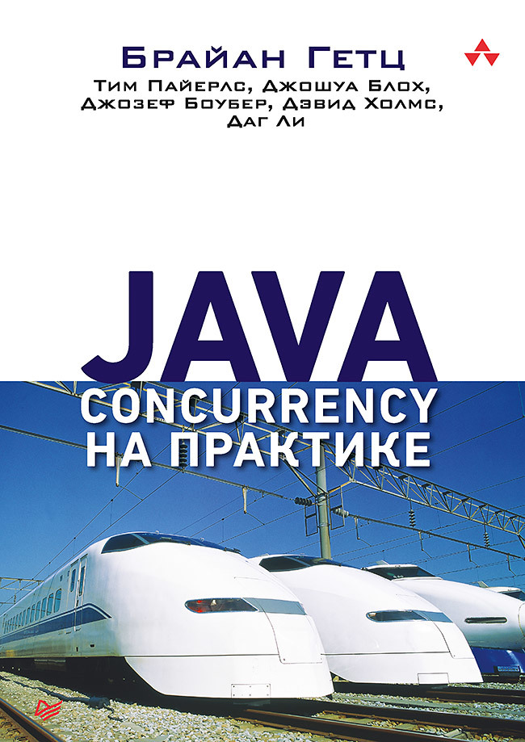
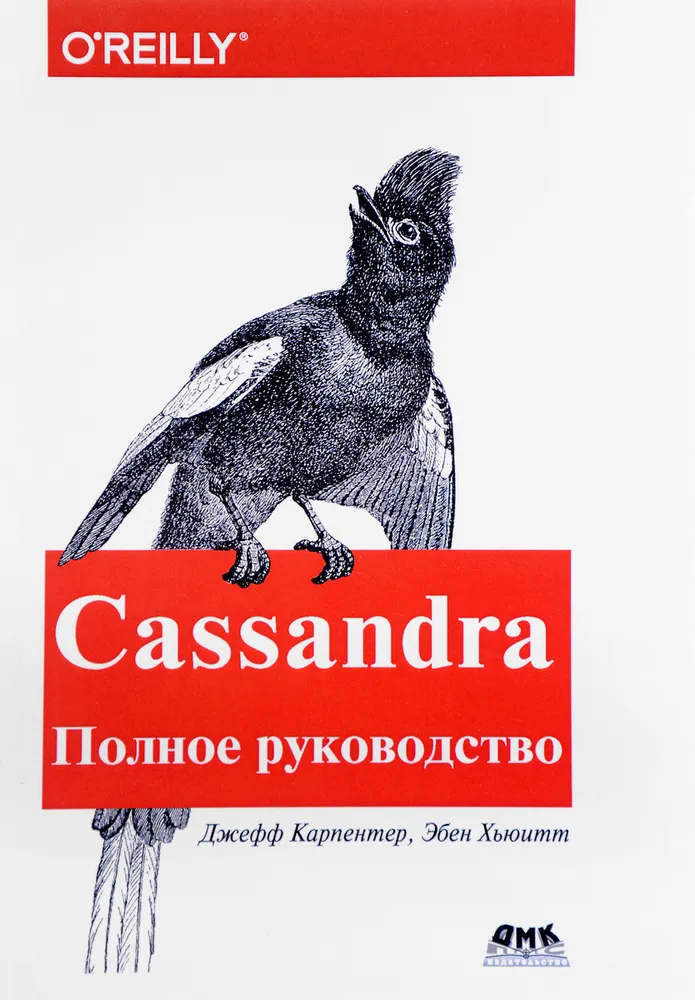
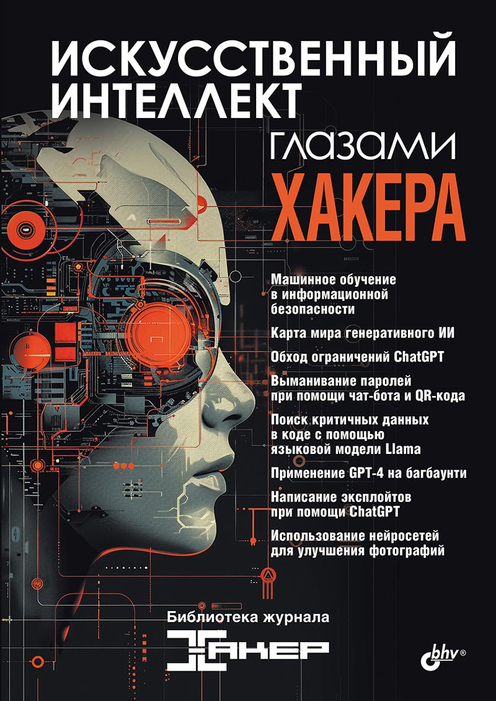
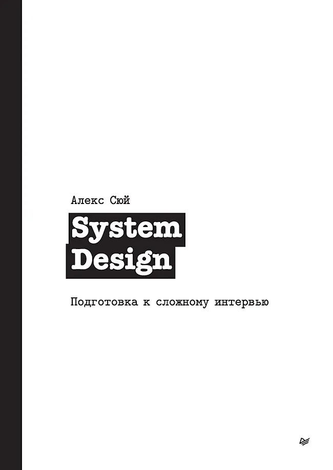
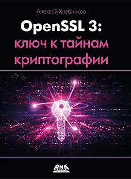
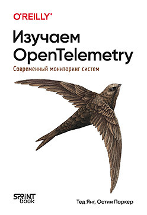

# read books

## Joe Gray - Practical Social Engineering: A Primer for the Ethical Hacker (Russian version: Социальная инженерия и этичный хакинг на практике)
2023, 226 pages, reading period: 16.01.26 - 02.02.2026\

 

## Martin Kleppmann - Designing Data-Intensive Applications (Russian version: Высоконагруженные приложения. Программирование, масштабирование, поддержка)
2018, 640 pages, reading period: 30.09.25 - 16.01.26\

 

## Brian Goetz, Tim Peierls, Joshua Bloch, Joseph Bowbeer, David Holmes, Doug Lea - Java Concurrency in Practice (Russian version: Java Concurrency на практике)
2020, 464 pages, reading period: 22.07.25 - 29.09.25\

 

## Jeff Carpenter, Eben Hewitt - Cassandra: The Definitive Guide: Distributed Data at Web Scale 2nd -  (Russian version: Cassandra. Полное руководство. 2-е изд.)
2017, 400 pages, reading period: 26.07.25 - 26.08.25\

 

## Коллектив авторов журнала "Хакер" - Искусственный интеллект глазами хакера
2025, 112 pages, reading period: 01.07.25 - 07.07.25\

 

## Ян Франсуа - Half-Life. Как Valve создала культовый шутер от первого лица
2024, 304 pages, reading period: 15.02.25 - 30.06.25\

 

## Alex Xu - System Design Interview – An insider's guide (Russian version: System Design. Подготовка к сложному интервью)
2022, 304 pages, reading period: 13.05.25 - 16.05.25\

 

## Alexei Khlebnikov - Demystifying Cryptography with OpenSSL 3.0 (Russian version: OpenSSL 3: ключ к тайнам криптографии)
2023, 302 pages, reading period: 10.02.25 - 02.05.25\

 

## Ted Young & Austin Parker - Learning OpenTelemetry (Russian version: Изучаем OpenTelemetry)
2025, 240 pages, reading period: 27.03.25 - 12.04.25\

 

## Бирюков А. А. - Информационная безопасность: защита и нападение (3-е изд.)
2024, 442 pages, reading period: 03.01.25 - 02.03.25\

 

## Kevin Mitnick - The Art of Invisibility (Russian version: Искусство быть невидимым)
2019, 464 pages, reading period: 14.01.25 - 14.02.25\

 

## Жуков А. Н. - Хакерство. Физические атаки с использованием хакерских устройств
2023, 306 pages, reading period: 28.11.24 - 03.01.25\

 

## Orange Pi R1 Plus LTS User Manual
2020, 170 pages, reading period: 30.10.24 - 12.11.24\

 

## Gian Marco Iodice - TinyML Cookbook (Russian version: TinyML Книга рецептов)
2024, 298 pages, reading period: 22.02.24 - 29.10.24\

 

## Mark Heckler - Spring Boot: Up and Running (Russian version: Spring Boot по-быстрому)
2022, 352 pages, reading period: 13.03.24 - 31.08.24\

 

## Orange Pi Zero 3 User Manual
2023, 321 pages, reading period: 29.06.24 - 01.08.24\

 

## Robert C. Martin - Clean Code (Russian version: Чистый Код)
2012, 464 pages, reading period: 13.01.24 - 22.02.24\

 

## Nik Lumi - EXCEPTIONS IN JAVA (Basics, advanced concepts, and real API examples)
2022, 115 pages, reading period: 09.01.24 - 07.02.24\

 

## Ken Kousen - Mockito Made Clear Java Unit Testing with Mocks, Stubs, and Spies
2023, 87 pages, reading period: 06.01.24 - 09.01.24\

 

## Robert C. Martin - Clean Craftsmanship (Russian version: Идеальная Работа)
2024, 384 pages, reading period: 31.12.23 - 06.01.24\

