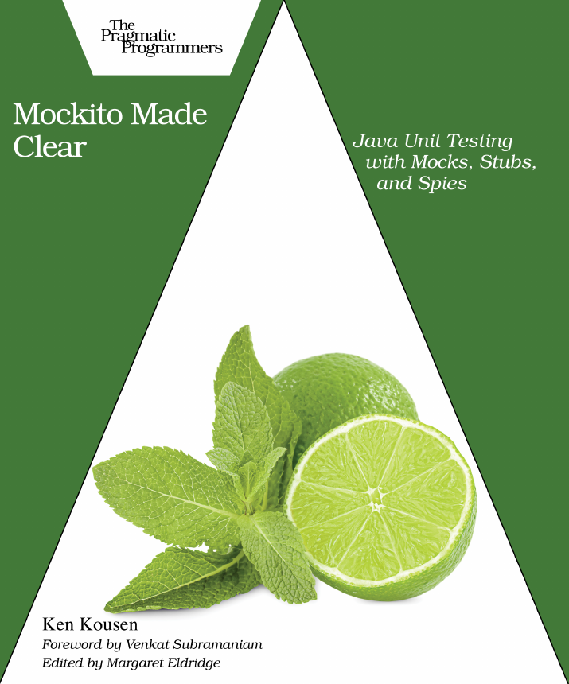

# read books

## Mark Heckler- Spring Boot: Up and Running (Russian version: Spring Boot по-быстрому)
2022, 352 pages, reading period: 13.03.24 - 31.08.24\

 

## Orange Pi Zero 3 User Manual
2023, 321 pages, reading period: 29.06.24 - 01.08.24\

 

## Robert C. Martin - Clean Code (Russian version: Чистый Код)
2012, 464 pages, reading period: 13.01.24 - 22.02.24\

 

## Nik Lumi - EXCEPTIONS IN JAVA (Basics, advanced concepts, and real API examples)
2022, 115 pages, reading period: 09.01.24 - 07.02.24\

 

## Ken Kousen - Mockito Made Clear Java Unit Testing with Mocks, Stubs, and Spies
2023, 87 pages, reading period: 06.01.24 - 09.01.24\

 

## Robert C. Martin - Clean Craftsmanship (Russian version: Идеальная Работа)
2024, 384 pages, reading period: 31.12.23 - 06.01.24\

